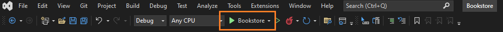
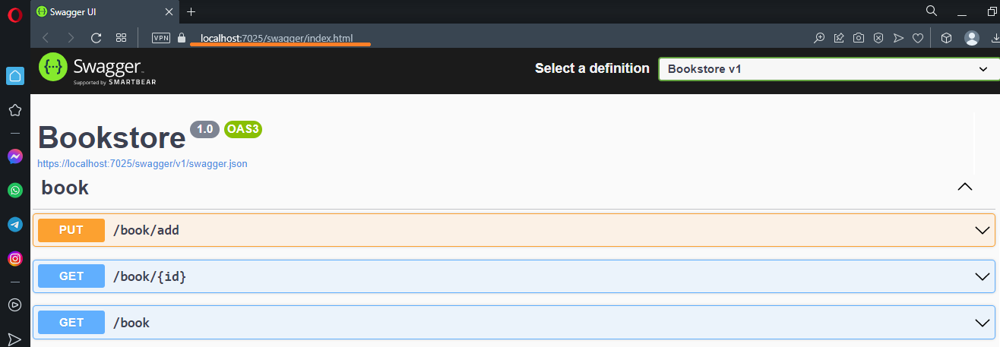
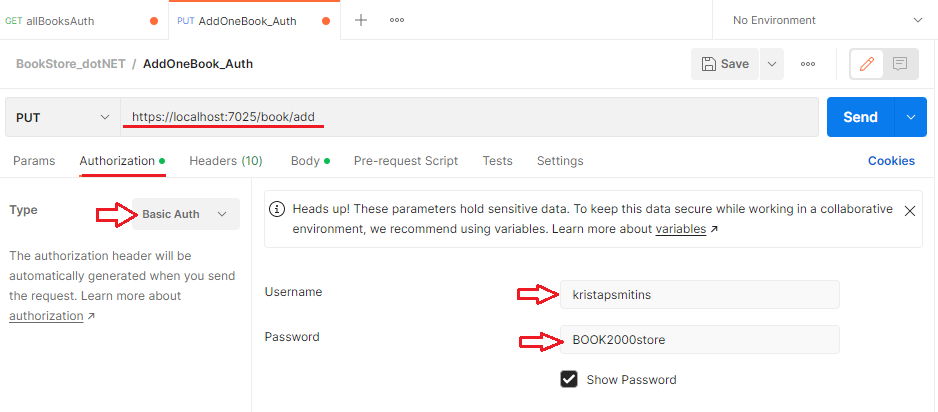
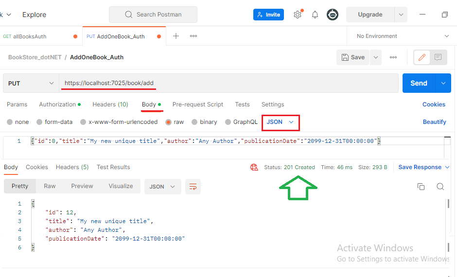

# Bookstore

An ASP.NET Core Web API .NET 6 application.

    - Only admin user can add a new book.
    - https://localhost:7025/book/?start=0&take=50 can return all Books or could be organized in pages.
    - Newest books are located at top.
    - System cannot store a new book which Title already exists.

### To run your program:

If you are new to .NET visit [microsoft.com](https://dotnet.microsoft.com/en-us/learn)

1. You need to clone or download project from GitHub [project page](https://github.com/kristaps-m/Bookstore-API.git)
2. You need the .NET Framework and an IDE (integrated development environment) to work with the C# language. [Try this page to get started.](https://www.simplilearn.com/c-sharp-programming-for-beginners-article)
3. Open and run project with capable IDE of your choice. I used Visual Studio in example below.

4. Visual Studio opens browser window automaticaly with Swagger project page or go 
[https://localhost:7025/swagger/index.html](https://localhost:7025/swagger/index.html)

5. To use Bookstore API and find book by ID, click on 'GET /book/{id}' --> 'Try it out' --> 'enter ID' -->'Execute'. If Book's ID exist it will return one book in Json format. If not it will return 'Not Found'.

To get list of books go: GET /book
Now you can get list of all books or organized in pages of books. Enter 'start'=0 and 'take' = 5 to get list of first 5 books.

6. [Download Postman](https://www.postman.com/downloads/)
To add book as Admin you will need to do it as Admin. To do this we will use Postman. If you have never used Postman before visit [Postman/introduction](https://learning.postman.com/docs/introduction/overview/)

In 'Bookstore.Data -> class BookStorage -> List<List<string>> Admins' I have saved username and password. Password is encoded in base64. 

To add book as Admin!
PUT 'https://localhost:7025/book/add'
Authorization: 'Basic Auth', username = kristapsmitins, password = BOOK2000store

Body: 'raw', 'JSON' = {"id":0,"title":"My new unique title","author":"Any Author","publicationDate":"2000-01-01T00:00:00"}

click 'SEND' it shoud return book in JSON format.

 

Congratulations! You have successfully added book.

Things I could improve:
1. Add delete book endpoint.
2. Add search by Author endpoint.
3. Add search by Title endpoint.
4. Add search by publicationDate range endpoint.
5. Modify Book class. (add BookSize, Availability, Genre).
6. Add SQL database.
7. Add Front End interface.